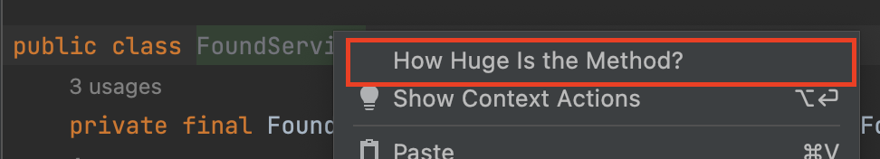
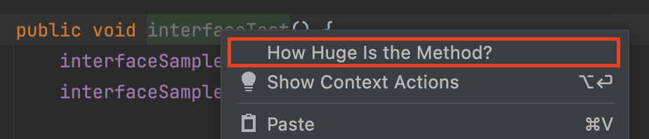
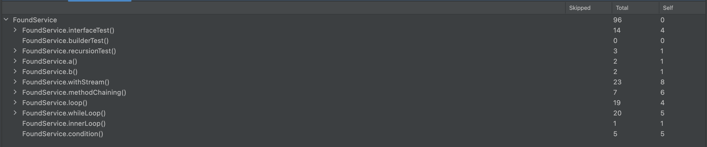

# How Huge Is The Method

## What is this

특정 자바 클래스/메소드의 크기(Statement 개수)를 계산하여, 공수를 추정할 수 있도록 도와주는 플러그인입니다.

## Requirements

- Java 프로젝트
- Intellij 2022.1.4 버전 이상

## 설치 방법

`HowHugeIsTheMethod-${version}.zip` 압축파일을 인텔리제이로 드래그&드랍하여 설치합니다.

## How to use

### 클래스 측정

클래스 이름 위에서 오른쪽 클릭 후 "How Huge Is The Method" 버튼을 클릭합니다.

### 메소드 측정

메소드 이름 위에서 오른쪽 클릭 후 "How Huge Is The Method" 버튼을 클릭합니다.

### 결과 화면

각 결과를 클릭하면, 해당 메소드로 이동합니다.

필드명 | 설명
:--|:--
Skipped | 해당 메소드가 이전에 계산되었다면 true
Total | 해당 메소드 내부 호출도 모두 계산된 결과. Self + 내부 메소드 호출 계산 결과
Self | 해당 메소드 내의 코드블럭만 계산한 결과 |
